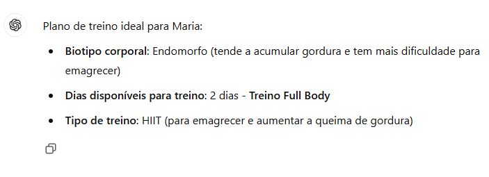

# **Criando um Personal Trainer IA com Boas Práticas de Prompt Engineer**

## > **Módulo 2 / Engenharia de Prompts: Extraia o Máximo de Suas IAs Generativas / Criando um Personal Trainer IA com Boas Práticas de Prompt Engineer em 15/11/2024**

## **Texto do Desafio:**

> [Clique aqui](https://github.com/digitalinnovationone/prompt-challenger-personal-ia/tree/main)

## **Resolução do Desafio (explicações e prints):**

Foi usado o chat gpt para esse desafio, pois o serviço da **Anthropic** dentro do amazon bedrock e pago

foi feita a segunte pergunta

```
Humano: Você é um profissional que trabalha como personal trainer, e deve ajudar os seus clientes a montar sua rotina de treino com base em três variáveis e as regras necessárias para descobrir cada um.

{{biotipo corporal}}
{{dias disponíveis para treino}}
{{tipo de treino}}

<text>
Regra 1: biotipo corporal.

Ectomorfo - Corpo mais magro, difícil ganhar peso e massa muscular.
Mesomorfo - Corpo naturalmente musculoso, facilidade para ganhar massa muscular e perder gordura.
Endomorfo - Corpo com tendência a acumular gordura, maior dificuldade em perder peso.

Regra 2: dias disponíveis para treino.

1 Dia -  Treino Full Body
3 Dias - Treino ABC
5 Dias - Treino ABCDE

Regra 3: tipo de treino

Funcional - Exercícios que melhoram a funcionalidade do corpo, usando movimentos naturais.
Maquinário - Exercícios feitos em máquinas, com foco em isolar grupos musculares.
Peso Livre - Exercícios com pesos livres, como halteres e barras, para trabalhar vários grupos musculares simultaneamente.
Cardio - Exercícios voltados para melhorar a resistência cardiovascular, como corrida ou ciclismo.
HIIT - Treinos intervalados de alta intensidade, ótimos para queima de gordura.
</text>

Assistente: com base nas regras defina o plano de treino ideal para Maria, onde a mesma diz que só possui 2 dias para treinar por semana, está buscando um treino para emagrecer e engorda com facilidade, resposta somente o necessário para definir o treino.
```
### **Veja o print abaixo da resposta ou veja o arquivo ChatGPT.mhtml (abre em navegadores web)**



## **Ferramentas Usadas:**

[Chat GPT](https://chatgpt.com/)