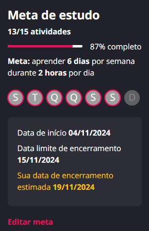

# Este projeto contém os desafios, atividades e demais conteúdos propostos para o **Boot Camp** “[Nexa - Engenharia de Prompts na AWS com Claude](https://web.dio.me/track/engenharia-prompts-aws?tab=about&utm_campaign=engenharia-prompts-aws)” com duração de 10 horas.

    

## Aviso

> **Em decorrência do print apresentado logo abaixo onde devido a meu procrastinamento acabou por expirar o tempo do bootcamp, devido a isso vou deixar esse trabalho em standby, até que o mesmo abra novamente.**

